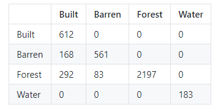

# Description
Python Library to automate the creation and analysis of PonitusMatrix.  
Version 1.2  
Python 3.7  
December, 2019  

# Dependencies & Usage
- Required libraries for pontiPy usage
```python
import numpy as np
import pandas as pd
```
- Creating a Dataframe from an inputted Sample & Loading the pontiPy package
```python
initialDataFrame = pd.read_csv('sample.csv', index_col= 0)
display(initialDataFrame)
NewDataFrame = testpontipy2(initialDataFrame)
```


# Functions  
Available functions in pontiPy Library  
## Contingency Table  
- Displays inputted matrix  
- Generates PontiusMatrix Contingency Table  
This will generate the final output contingency table  
#### Arguments  
- **Generates Initial Contingency Table** = contingency_table()  
#### Examples  
- Displaying the sample data through the contingency table function
```python
display(NewDataFrame.contingency_table())
```


## Size  
- Function to Compute Size for all or one Category k  
- Axis must be specified when category k is specified   
- Determines if row or column sum for category k will be returned   
#### Arguments  
- **No category specified** = size()  
Size of Extent  
- **Category k specified** = size(k)  
Size of category k    
a) Axis 'X' = Size of category k in X (row sum): size(k, X)  
b) Axis 'Y' = Size of category k in Y (col sum): size(k, Y)  
c) No Axis specified = Size of category k  
- **Category k Specified with TRUE** = size(k, X or Y, TRUE)  
Dictionary listing the size of other categories contained in category k (includes hits)  
#### Example  
```python
print('Size of Extent:', NewDataFrame.size(), 'Hectares') 
```
>> _Size of Extent: 25662 Hectares_  

```python
print('Size of Category 1 in X:', NewDataFrame.size(0,'X'),'Hectares')  
```
>> _Size of Category 1 in X: 2296 Hectares_  

```python
print('Size of Category 1 in Y:', NewDataFrame.size(0,'Y'),'Hectares')
```
>> _Size of Category 1 in Y: 2144 Hectares_  


## Difference 
- Function to compute difference for all or one category  
#### Arguments  
- **No category specified** = difference()  
Equation = Total Size - Hits    
- **Category k specified** = difference(k)  
Equation = Size-*(2*Hits) For That Category  
#### Example  
```python
print('Total Difference:', NewDataFrame.difference(), 'Hectares')  
```  
>> _Total Difference:  Hectares_  

```python
print('Difference for Category 1:', NewDataFrame.difference(0), 'Hectares')  
```   
>> _Difference for Category 1:  Hectares_  


## Hits, Miss, and False Alarm  
- Functions to compute Hits, Misses, and False Alarms  
#### Arguments  
- **No Category specified** = hits(), miss(), false_alarm()  
Sum of Total Hits, Misses, or False Alarms  
- **Category k specified** = hits(k), miss(k), false_alarm(k)  
Hits, Misses, or False Alarms for Category k  
#### Example  
```python
print('Total Hits:', NewDataFrame.hits(), 'Hectares')  
```
>> _Total Hits: 3553 Hectares_  

```python
print('Total Misses:', NewDataFrame.miss(), 'Hectares')  
```
>> _Total Misses: 8735 Hectares_  

```python
print('The Total False Alarms:', NewDataFrame.false_alarm(), 'Hectares')  
```
>> _The Total False Alarms: 8735 Hectares_  


## Quantity 
Function to compute quantity between all or one category  
Returns as a dictionary  
#### Arguments    
- **No Category Specified** = quantity()  
Total Quantity Disagreement  
Equation = [Sum of quantity(k) for all k] / 2  
- **Category k Specified:** = quantity(k)    
Quantity Disagreement for k: |M-F|   
- **Category k Specified with TRUE parameter):** = quantity(k,TRUE)  
Quantity is returned with Miss or False Alarm labels:  
If M-F is positive = Miss Quantity   
If M-F is negative = False Alarm Quantity    
If value = 0, then Quantity is 0    
#### Example  
```python
print('Total Quantity Disagreement:', NewDataFrame.quantity(), 'Hectares')
```  
>> _Total Quantity Disagreement: 76 Hectares_  

```python  
print('Quantity Disagreement for Category 1 w/ label:', NewDataFrame.quantity(0, True), 'Hectares')
```  
>> _Quantity Disagreement for Category 1 w/ label: {'False Alarm': 152} Hectares_  


## Exchange      
Function to compute Exchange between ALL, ONE or TWO categories     
#### Arguments  
- **No Category Specified** = exchange()      
Sum of total exchange is returned   
Total must be false  
- **If total is False and 1 category is specified:** =  exchange(TRUE,k)  
Return is exchange for that category with all other categories + a total value in dictionary   
- **If Total is True and 1 category is specified:** = exchange(FALSE,k)  
Return is total exchange for that category  
- **If 2 categories are specified (Total must be false):** = exchange(FALSE,k,k)  
Return exchange between 2 categories  
#### Example   
```python
print('Total Exchange Disagreement:', NewDataFrame.exchange(), 'Hectares')
```  
>> _Total Exchange Disagreement: 0 Hectares_  

```python
print('Exchange between Category 1 and 2:', NewDataFrame.exchange(0,1), 'Hectares')
```  
>> _Exchange between Category 1 and 2: 0 Hectares_  

## Shift  
Function to compute shift between ALL or ONE categories  
#### Arguments  
- **No Category Specified** = shift()  
Total Shift Disagreement  
Equation = [sum of shift(k) for all k] / 2  
- **Category k specified** = shift(k)  
Shift Disagreement for k  
Equation = difference(k) – quantity(k) – exchange(k)    
#### Example     
```python
print('Total Shift Disagreement:', NewDataFrame.shift(), 'Hectares')
```  
```python
print('Shift Disagreement for Category 1:', NewDataFrame.shift(0), 'Hectares')
```    

# Further Information & Contact
- **Library Information:**  
Priyanka Verma, prverma@clarku.edu    

- **Metric Methodolgy:**  
Robert (Gil) Pontius, rpontius@clarku.edu  
See Metrics that Make a Difference, Chapter 4  
Link to Chapter 4

# Acknowledgements

_Dr. Robert Gilmore Pontius Jr created the first version of this workbook in 2001. Pontius has revised this workbook several times, and each revision has a larger number for the suffix of the filename. Pontius created version 42 in 2019._  

_Visit www.clarku.edu/~rpontius for publications on this workbook's methods. Specificaly, see:
Pontius Jr, Robert Gilmore and Ali Santacruz. 2014. Quantity, Exchange and Shift Components of Differences in a Square Contingency Table. International Journal of Remote Sensing 35(21): 7543-7554._  

_Pontius Jr, Robert Gilmore. 2019. Component intensities to relate difference by category with difference overall. International Journal of Applied Earth Observations and Geoinformation 77: 94-99._  

_Pontius Jr, Robert Gilmore and Marco Millones. 2011. Death to Kappa: birth of quantity disagreement and allocation disagreement for accuracy assessment. International Journal of Remote Sensing 32(15): 4407-4429._  

_Aldwaik, Safaa Zakaria, Jeffrey A Onsted, and Robert Gilmore Pontius Jr. 2015. Behavior-based aggregation of land categories for temporal change analysis. International Journal of Applied Earth Observation and Geoinformation 35(Part B): 229-238._
